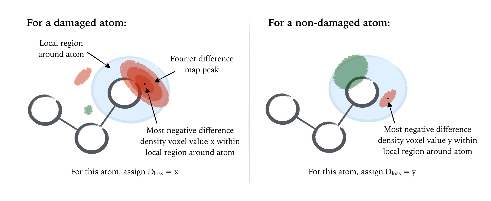
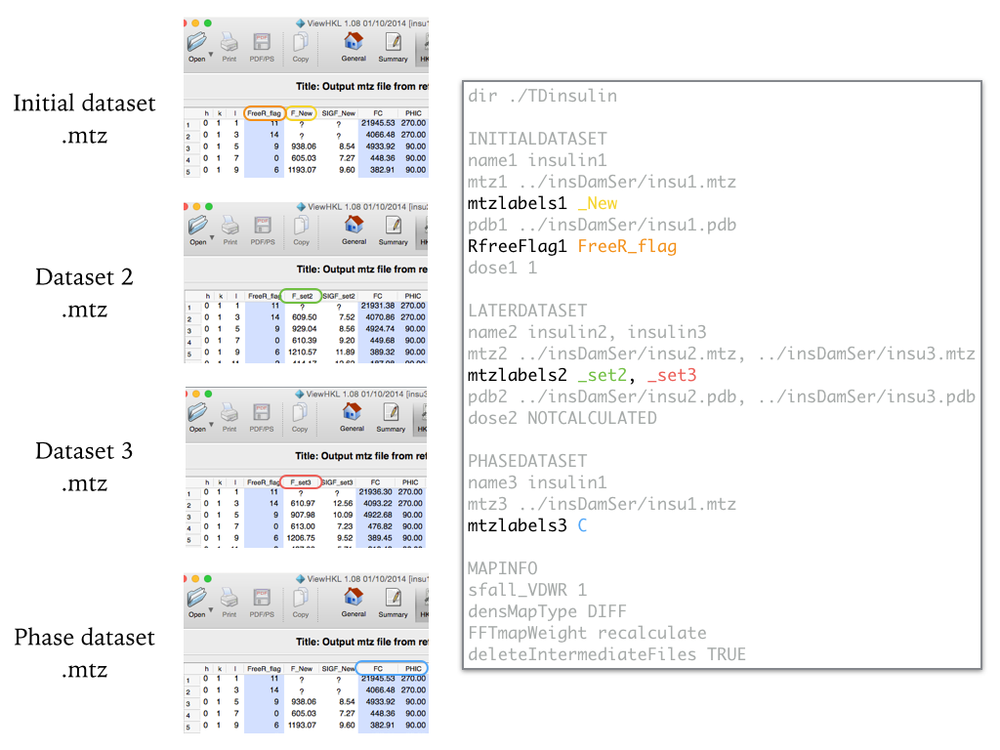

# ETRACK

A collection of scripts to calculate per-atom density change metrics within a specific damage MX investigation.
Suitable for any MX experiment in which datasets are collected on the **same crystal** over **multiple doses**.
**NOTE: These scripts are currently under development and updated regularly..**

## In short: how to run

- Write an input file for the job (e.g. input.txt)

- Run on command line ```python ETRACK.py -i input.txt -pc```

## A brief background

During MX data collection, when a protein or nucleic acid crystal is exposed to increasing doses of radiation, localised radiation-induced chemical changes can occur within the crystalline macromolecules, even at doses of the order of several MGy (at 100 K). These *specific damage* manifestations can ultimately leading to false biological interpretations within structures during subsequent model building if not accounted for. 

Localised chemical changes within a macromolecule can be detected by observing shifts in the electron density attributed to particular atoms within the crystal with increasing dose. For instance, radiation-induced decarboxylation of glutamate and aspartate residues has been reported, for a wide range of crystalline model protein systems, as the deterioration in density local to the carboxylate group at different dose states within F<sub>obs</sub>(d<sub>n</sub>) - F<sub>obs</sub>(d<sub>1</sub>) Fourier difference maps between different accumulated dose states d<sub>1</sub> and d<sub>n</sub> within a single crystal.

Specific radiation damage has been well characterised previously using Fourier difference maps and detecting *difference map peaks* (i.e. localised regions of significant electron density *loss* or *gain* with increasing dose). However, such time-intensive visual inspection is limited by the inherent subjective bias of the investigator; a problem that is compounded by the fact that with increasing dose Fourier difference maps become increasingly noisy, due to the overall degradation of the diffraction data quality (global radiation damage) and unmodelled chemistry within crystal bulk solvent regions. To mitigate such bias and permit systematic categorisation of radiation-induced structure changes over a series of increasing doses for individual refined atoms within a structure, the set of scripts **ETRACK** has been written to provide a pipeline to calculate per-atom metrics to quantify the damage susceptibility of each refined atom within a macromolecular structure.

### The purpose

Whereas previous studies have characterised specific radiation damage in terms of Fourier difference map peak heights (in either units of *sigma-levels* or *electrons per cubic Angstrom*) and their proximity to atoms within a structure, *ETRACK* approaches the problem the other way around. The behaviour of the Fourier difference map in the localised region around each atom is determined, and the maximum density loss value *D<sub>loss</sub>* within this region computed per atom. For atoms in close proximity to negative Fourier difference map peaks, this is equivalent to determining the high of the Fourier difference map peak (in electrons per cubic Angstrom) and assigning this value to that atom, however this procedure now assigns a *D<sub>loss</sub>* density change value to *every* atom within the structure, regardless of the proximity of Fourier difference map peaks.



## Usage

### Requirements

The scripts require the following to run:

- A series of input *.pdb* and *.mtz* files corresponding to a damage series collected from an individual crystal

- *Python 2.7* (main testing performed on 2.7.10)

- The *CCP4 suite* downloaded (version non-specific, but tested on 6.4.0, 6.5, and some minor testing on version 7.0)

- The *seaborn* python plotting library is highly recommended (use `pip install seaborn` to gain access to this plotting library). The scripts should now be able to run to completion without seaborn, however no plots will be produced at run time.

- A list of calculated doses for the series is ideal for radiation damage analysis (but not essential). Visit www.raddo.se for full details on how to download the current version of *RADDOSE-3D*.

### Running ETRACK from command line

Assume here we have a damage series collected on a single crystal, comprising of increasing dose .pdb and .mtz files (e.g. dataset1.pdb, dataset1.mtz, dataset2.pdb, dataset2.mtz, ...)

The simplest way to run the ETRACK pipeline is run it directly from the command line. 

```python ETRACK.py -i inputFile.txt -p -c```

An input file *inputFile.txt* is required to specify input *.pdb* coordinate files and *.mtz* merged structure factor files per dataset. The input file provides the information to generate Fourier differences for each high dose dataset successively within the series. See the section "*Writing the ETRACK input file*" for details on how to write this input file.

Several command line flags are required to run the program:

- `-p` indicates that the *processing* step is to be performed, in order to generate compatible Fourier difference maps and atom-tagged maps at each dose level.

- `-c` indicates that the *calculation* step is to be performed, in order to then calculate the per-atom *D<sub>loss</sub>* metric. 

- `-g` (optional) can be used to prevent any graphs from being plotted at run time (will speed up the run). 

### Writing the ETRACK input file

For the general case the ETRACK input file must be written manually, specifying correct .mtz column label information as required. To aid this, the command:

```python ETRACK.py -j```

can be run to output to the command line some useful information on how to successfully write the input file. Additionally the command:

```python ETRACK.py -t n```

where `n` is an integer parameter to specified (corresponding to the number of higher dose datasets), will generate a template input file *templateInputFile.txt* for the user to complete.

##### An example input file

Here is an example input file for a damage series of 3 increasing dose datasets collected on a single insulin crystal.

```
dir ./TDinsulin/

INITIALDATASET
name1 insulin1
mtz1 ../insDamSer/insu1.mtz
mtzlabels1 _New
pdb1 ../insDamSer/insu1.pdb
RfreeFlag1 FreeR_flag
dose1 1.2

LATERDATASET
name2 insulin2, insulin3
mtz2 ../insDamSer/insu2.mtz, ../insDamSer/insu3.mtz
mtzlabels2 _set2, _set3
pdb2 ../insDamSer/insu2.pdb, ../insDamSer/insu3.pdb
dose2 3.1, 5.6

PHASEDATASET
name3 insulin1
mtz3 ../insDamSer/insu1.mtz
mtzlabels3 C

MAPINFO
sfall_VDWR 1
densMapType DIFF
FFTmapWeight False
deleteIntermediateFiles TRUE
```

`dir` is the directory where the output files should be written.

The dataset information for the damage series is broken down into three sections: `INITIALDATASET`, `LATERDATASET` and `PHASEDATASET`. 

The `INITIALDATASET` section contains information about the first dataset within the damage series:

- `name1` is the name you would like to call the first dataset. This will affect the naming of files subsequently generated by ETRACK. This name does not have to be the same as the input .pdb or .mtz files for the first dataset.

- `mtz1` is the path to the first dataset .mtz file.

- `mtzlabels1` is the labelling convention within the first dataset .mtz file for the Fobs and SIGFobs columns. In the above example the Fobs column is currently *F_New* and the SIGFobs is set to *SIGF_New*, such that this input becomes `_New` above. Currently, the same labelling convention must be present for both the Fobs and SIGFobs columns within the input .mtz file.

- `pdb1` is the path to the first dataset .pdb file.

- `RfreeFlag1` is the full column name for the Rfree column as specified within the input .mtz file.

- `dose1` is the calculated dose for the first dataset within the damage series. It is recommended that *RADDOSE-3D* is run prior to ETRACK (see www.raddo.se). If doses are unknown, set this input to `NOTCALCULATED`.

The `LATERDATASET` section contains the information about the later (higher dose) dataset within the damage series. See the `INITIALDATASET` section above for details of the inputs to be specified. The main noticable difference for `LATERDATASET` is that multiple higher dose datasets can be processed successively within the same input file, by including comma-separated inputs within this section (see the input file example above). This is the recommended way to process a damage series comprising multiple higher dose datasets.

The `PHASEDATASET` contains information of .mtz file from which the phases will be taken. These are required for generating Fourier difference maps at run time. The `mtzlabels3` parameter specifies the Fcalc and PHIcalc column labels within the input .mtz file. For columns labelled *FC* and *PHIC*, the `mtzlabels3` input is simply `C`.

In the above example, the first dataset .mtz is again chosen, and this is the recommended dataset to take. In this case, set `name3` to be the same as `name1`.

The `MAPINFO` section contains additional run information for ETRACK. It is recommended that the parameters within this section are not modified as this may lead to run issues.

Below is a screenshot indicate how to choose label names from your .mtz files for each dataset within the damage series.



## The methodology explained with an example from PDB_redo

To demonstrate how ETRACK can be run (and what it is doing), the following section walks through how to process an example damage series retrieved from PDB_redo.

##### Retrieving an example damage series from PDB_redo

To demonstrate how the scripts can be run, the script *getPDBseries.py* can be used to retrieve a pdb series from *pdb_redo*. Here the first 3 entries within the *Weik M, et al. (2000) PNAS 97(2):623–8* have been selected as a test damage series to demonstrate the functionality of the ETRACK scripts.  In python:

```python
import os
os.system('mkdir testOutput') # make a directory for this test run
from getPDBSeries import getSeries

for i in ['1qid','1qie','1qif']:
	p = getSeries(PDBcode=i, outputDir='./testOutput/')
```

Now that the *.pdb* and *.mtz* files have been retrieved for each dataset within this selected damage series, the ETRACK scripts can be run to calculate per-atom damage metrics. The basic structure of the pipeline is as follows:

For each high dose dataset (*1qie* or *1qif*, n=2,3 respectively here):

- A single *.mtz* file is written combining F<sub>obs</sub> columns from the initial low dose dataset (*1qid*, n=1 here) with the F<sub>obs</sub> columns of the high dose dataset using *CAD*.

- The later dataset F<sub>obs</sub> column is scaled to the initial dataset F<sub>obs</sub> column values using *SCALEIT*.

- A F<sub>obs</sub>(d<sub>n</sub>)-F<sub>obs</sub>(d<sub>1</sub>) Fourier difference map *.map* file is computed over the unit cell for each higher dose dataset (n=2,3 here) using *FFT*.

- Any hydrogens and alternative conformations are stripped, and anisotropic B-factors are removed from the input *.pdb* file using *PDBCUR* and then an *atom-tagged* .map file is generated over the crystal unit cell in *SFALL* using the exact same grid sampling dimensions as the *FFT*-output Fourier difference map above, using this stripped *.pdb* file. In this map, each voxel is assigned the atom number of the refined atom within the structure that contributes the most electron density to that specific region in space. Note that not all voxels are assigned to atom numbers (with some voxels instead assigned to bulk solvent).

- Both the atom-tagged map and the Fourier difference map are cropped to the crystal asymmetric unit using *MAPMASK*. The resulting atom-tagged map and Fourier difference map are now of compatible grid sampling dimensions.

- Using these two map types, each refined atom within a structure can now be assigned a set of *difference density* values X(atom) directly from the Fourier difference map.

- To describe the electron density behaviour of each refined atom with increasing dose, the most negative *difference density* value within the set X(atom) is assigned as D<sub>loss</sub>(dose). Since Fourier difference maps have been used, negative difference density values correspond to localised regions of electron density loss with increasing dose.


For this damage series, an example input file has been supplied called *exampleInputFile.txt*. ETRACK can now be run by running:

```python ETRACK.py -i exampleInputFile.txt -pc```

from the directory containing the *exampleInputFile.txt* file.

