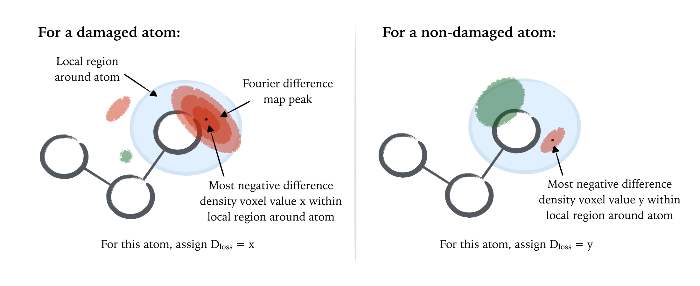

# RIDL: Radiation-Induced Density Loss

A program to calculate per-atom density change metrics for a specific damage MX investigation.
Suitable for any MX experiment in which datasets are collected on the **same crystal** over **multiple doses**.
**NOTE: These scripts are currently under development and updated regularly..**

## Contents
- [How to run in brief](#how-to-run-in-brief)
- [A brief background](#a-brief-background)
- [Usage](#usage)
	- [Requirements](#requirements)
	- [Running RIDL from command line](#running-ridl-from-command-line)
	- [Writing the RIDL input file](#writing-the-ridl-input-file)
- [The methodology explained with an example from PDB_redo](#the-methodology-explained-with-an-example-from-pdb_redo)

## How to run in brief

- Compose an input file for the job (e.g. input.txt). See: [Writing the RIDL input file](#writing-the-ridl-input-file)

- Run on command line ```python runRIDL.py -i input.txt -pco```

## Queries

Please email *charles.bury@dtc.ox.ac.uk*

## A brief background

During MX data collection, when a protein or nucleic acid crystal is exposed to increasing doses of radiation, localised radiation-induced chemical changes can occur within the crystalline macromolecules, even at doses of the order of several MGy (at 100 K). These *specific damage* manifestations can ultimately leading to false biological interpretations within structures during subsequent model building if not accounted for. 

Localised chemical changes within a macromolecule can be detected by observing shifts in the electron density attributed to particular atoms within the crystal with increasing dose. For instance, radiation-induced decarboxylation of glutamate and aspartate residues has been reported, for a wide range of crystalline model protein systems, as the deterioration in density local to the carboxylate group at different dose states within *F<sub>obs</sub>(d<sub>n</sub>) - F<sub>obs</sub>(d<sub>1</sub>)* Fourier difference maps between different accumulated dose states *d<sub>1</sub>* and *d<sub>n</sub>* within a single crystal.

Specific radiation damage has been well characterised previously using Fourier difference maps and detecting *difference map peaks* (i.e. localised regions of significant electron density *loss* or *gain* with increasing dose). However, such time-intensive visual inspection is limited by the inherent subjective bias of the investigator; a problem that is compounded by the fact that with increasing dose Fourier difference maps become increasingly noisy, due to the overall degradation of the diffraction data quality (global radiation damage) and unmodelled chemistry within crystal bulk solvent regions. To mitigate such bias and permit systematic categorisation of radiation-induced structure changes over a series of increasing doses for individual refined atoms within a structure, the set of scripts **RIDL** has been written to provide a pipeline to calculate per-atom metrics to quantify the damage susceptibility of each refined atom within a macromolecular structure.

### The purpose

Whereas previous studies have characterised specific radiation damage in terms of Fourier difference map peak heights (in either units of *sigma-levels* or *electrons per cubic Angstrom*) and their proximity to atoms within a structure, *RIDL* approaches the problem the other way around. The behaviour of the Fourier difference map in the localised region around each atom is determined, and the maximum density loss value *D<sub>loss</sub>* within this region computed per atom. For atoms in close proximity to negative Fourier difference map peaks, this is equivalent to determining the high of the Fourier difference map peak (in electrons per cubic Angstrom) and assigning this value to that atom, however this procedure now assigns a *D<sub>loss</sub>* density change value to *every* atom within the structure, regardless of the proximity of Fourier difference map peaks.



## Usage

### Requirements

The scripts require the following to run:

- A series of input *.pdb* and *.mtz* files corresponding to a damage series collected from an individual crystal

- *Python 2.7* (main testing performed on 2.7.10)

- The *CCP4 suite* downloaded (version non-specific, but tested on 6.4.0, 6.5, and some minor testing on version 7.0)

- The *seaborn* python plotting library is highly recommended (use `pip install seaborn` to gain access to this plotting library). The scripts should now be able to run to completion without seaborn, however no plots will be produced at run time.

- A list of calculated doses for the series is ideal for radiation damage analysis (but not essential). Visit www.raddo.se for full details on how to download the current version of *RADDOSE-3D*.

### Running RIDL from command line

Assume here we have a damage series collected on a single crystal, comprising of increasing dose *.pdb* and *.mtz* files (e.g. *dataset1.pdb*, *dataset1.mtz*, *dataset2.pdb*, *dataset2.mtz*, ...)

The simplest way to run the RIDL pipeline is run it directly from the command line. For a default run of RIDL (including generation of HTML-format summary file with accompanying SVG-format graphs), run:

```python runRIDL.py -i inputFile.txt -p -c -o```

An input file *inputFile.txt* is required to specify input *.pdb* coordinate files and *.mtz* merged structure factor files per dataset. The input file provides the information to generate Fourier differences for each high dose dataset successively within the series. See the section "*Writing the RIDL input file*" for details on how to write this input file.

Several command line flags are required to run the program:

- `-p` indicates that the *processing* step is to be performed, in order to generate compatible Fourier difference maps and atom-tagged maps at each dose level.

- `-c` indicates that the *calculation* step is to be performed, in order to then calculate the per-atom *D<sub>loss</sub>* metric. By default, CSV-format files of the *D<sub>loss</sub>* metric per atom will be generated in the output directory location.

- `-o` indicates that the full output summary file should be generated. This is currently a HTML-format file (including bootstrap features, internet access permitting). As a warning, including this option will currently make separate SVG-format graph files (stored in output subdirectories), and dependent on (a) the number of datasets in a damage series and (b) the total number of atoms within a structure, may take time to complete.

- `-s` (optional) 'silent mode' can be used to prevent any text being output to the command line at run time.

- `-g` (optional) can be used to prevent any graphs from being plotted at run time (will speed up the run). 

### Writing the RIDL input file

For the general case the RIDL input file must be written manually, specifying correct .mtz column label information as required. To aid this, the command:

```python runRIDL.py -j```

can be run to output to the command line some useful information on how to successfully write the input file. Additionally the command:

```python runRIDL.py -t n```

where `n` is an integer parameter to specified (corresponding to the number of higher dose datasets), will generate a template input file *templateInputFile.txt* for the user to complete.

##### An example input file

Here is an example input file for a damage series of 3 increasing dose datasets collected on a single insulin crystal.

```
dir ./TDinsulin/

INITIALDATASET
name1 insulin1
mtz1 ../insDamSer/insu1.mtz
mtzlabels1 _New
pdb1 ../insDamSer/insu1.pdb
RfreeFlag1 FreeR_flag
dose1 1.2

LATERDATASET
name2 insulin2, insulin3
mtz2 ../insDamSer/insu2.mtz, ../insDamSer/insu3.mtz
mtzlabels2 _set2, _set3
pdb2 ../insDamSer/insu2.pdb, ../insDamSer/insu3.pdb
dose2 3.1, 5.6

PHASEDATASET
name3 insulin1
mtz3 ../insDamSer/insu1.mtz
phaseLabel PHIC
FcalcLabel FC
```

`dir` is the directory where the output files should be written

The dataset information for the damage series is broken down into three sections: `INITIALDATASET`, `LATERDATASET` and `PHASEDATASET`. 

The `INITIALDATASET` section contains information about the first dataset within the damage series:

Property | Description
--- | --- 
`name1` | Name you would like to call the first dataset. This will affect the naming of files subsequently generated by RIDL. This name does not have to be the same as the input .pdb or *.mtz* files for the first dataset
`mtz1` | the path to the first dataset *.mtz* file
`mtzlabels1` | Labelling convention for first dataset *.mtz* file for the *Fobs* and *SIGFobs* columns. In the above example the Fobs column is currently *F_New* and the *SIGFobs* is set to *SIGF_New*, such that this input becomes `_New` above. Currently, the same labelling convention must be present for both the *Fobs* and *SIGFobs* columns in the input *.mtz* file
`pdb1` | Full path to the first dataset *.pdb* file
`RfreeFlag1` | Full *R<sub>free</sub>* column name as specified within the input *.mtz* file
`dose1` | Calculated dose for the first dataset. It is recommended that *RADDOSE-3D* is run prior to RIDL (see *www.raddo.se*). If doses are unknown, set this input to `NOTCALCULATED

The `LATERDATASET` section contains the information about the later (higher dose) dataset within the damage series. See the `INITIALDATASET` section above for details of the inputs to be specified. The main noticable difference for `LATERDATASET` is that multiple higher dose datasets can be processed successively within the same input file, by including comma-separated inputs within this section (see the input file example above). This is the recommended way to process a damage series comprising multiple higher dose datasets.

The `PHASEDATASET` contains information of MTZ-format file from which the phases will be taken. These are required for generating Fourier difference maps at run time. The additional properties here are:

Property | Description
--- | --- 
`FcalcLabel` | calculated structure factor column label in input *.mtz* file
`phaseLabel` | model phase column label in input *.mtz* file

In the above example, the first dataset *.mtz* is again chosen, and this is the recommended dataset to take. In this case, set `name3` to be the same as `name1`.

## Inspecting the output

RIDL has two output modes. To generate simply CSV-format files of the *D<sub>loss</sub>* metric per atom, run:

```python runRIDL.py -pc```

These CSV-format files will appear in the output subdirectory `RIDL-metrics/csvFiles/`.

The full HTML-format summary file can be generated by running:

```python runRIDL.py -pco```

The summary file will be output to the output subdirectory `RIDL-metrics/`. The summary file is designed to be self expanatory. Please email *charles.bury@dtc.ox.ac.uk* for queries on the interpretation of this summary file.

## Citing when using the scripts

The formulation of the *D<sub>loss</sub>* metric can be found at:

- Bury CS, et al. (2016) RNA protects a nucleoprotein complex against radiation damage. Acta Crystallogr Sect D Struct Biol 72(5):648–657.

Please cite this if you would like to use these scripts for your own specific damage analysis.


