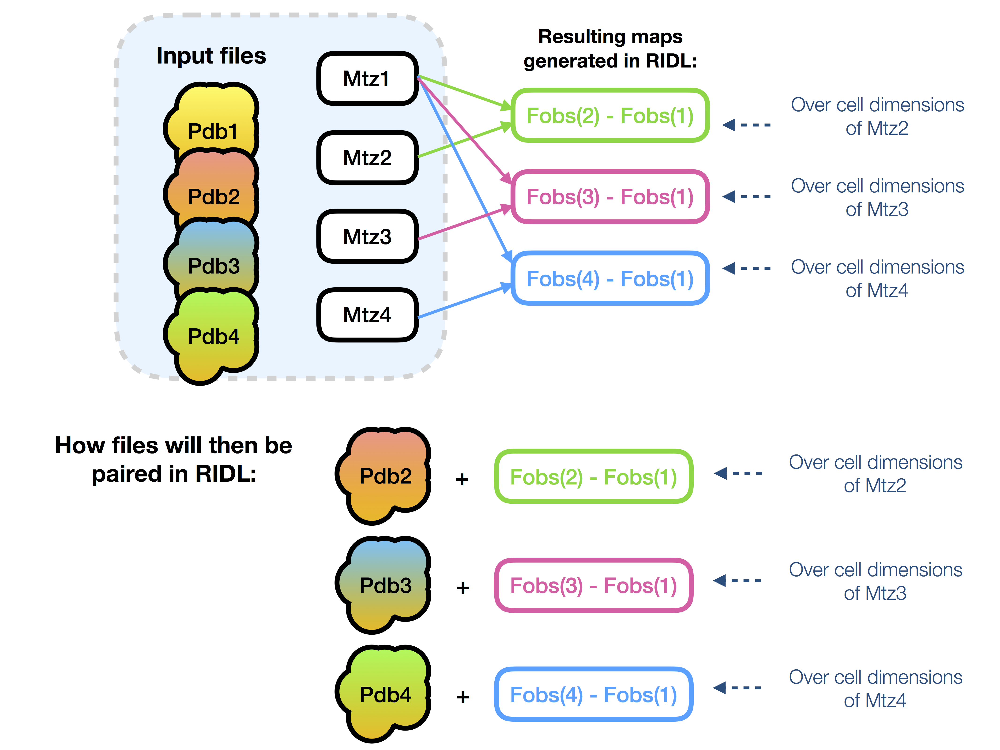

# RIDL: Radiation-Induced Density Loss

[](https://badge.fury.io/py/scikit-learn)
[](https://www.python.org/downloads/release/python-360/)
[](https://doi.org/10.5281/zenodo.1043864)

A program to calculate per-atom metrics to describe electron density change between **complete diffraction datasets** collected at **successive doses**. 
It has been primarily developed as a high-throughput tool for site-specific radiation damage analysis, however is also applicable for tracking time-dependent changes in time-resolved crystallographic data. It has been primarily developed as a high-throughput tool for site-specific radiation damage analysis, however is also applicable for tracking time-dependent changes in time-resolved crystallographic data.

### New!:

a) There is a full wiki available for RIDL: https://github.com/charliebury/RIDL/wiki

b) New publication online now:
- Bury CS and Garman EF. (2018) *RIDL*: a tool to investigate radiation‐induced density loss. J Applied Crystallography 51(3): 952-962.

Paper available here: https://onlinelibrary.wiley.com/doi/abs/10.1107/S1600576718005241.

c) Python environments for running RIDL (2.7 and 3.6 supported). See section below


## Queries and feedback

- Please email *ridl.help@gmail.com*

- Let me know your thoughts so that I can improve the program: https://goo.gl/forms/9aRrEwT1TUUqLroB2 (this is an anonymous form)

- If you see a bug and it is not reported in the "*Issues and errors*" section below, please let me know!

## Contents
- [How to run in brief](#how-to-run-in-brief)
- [A brief background](#a-brief-background)
- [Dependencies](#dependencies)
- [Python environments for running RIDL](#Python-environments-for-running-RIDL)
- [Writing the RIDL input file](#writing-the-ridl-input-file)
- [Running RIDL from command line](#running-ridl-from-command-line)
- [Inspecting the output](#inspecting-the-output)
- [Issues and errors](#issues-and-errors)
- [Citing when using the scripts](#citing-when-using-the-scripts)

## How to run in brief

- Compose a plain text input file for the job. See: "*Writing the RIDL input file*" section below

- Check that input data are in a suitable format. See "*What data are needed to run RIDL?*" section below

- Run on command line using ```python runRIDL.py -i input.txt -pco```

- If RIDL does not run to completion, please see the section "*RIDL did not finish, help!*" below for help. 

## Quick hints:

- Running for the first time? Use ```python runRIDL.py --dependencies``` to check all required dependencies are present.

- The RIDL pipeline has been broken down into 3 components:
    - map generation: ```-p```
    - metric calculation: ```-c```
    - output file generation: ```-o```
- All three steps can be run at once: ```python runRIDL.py -i input.txt -pco```, or as 3 sequential command line calls. 

- To save room, use the additional command line flag ```--remove_maps``` to remove any generated .map files after a run has finished: ```python runRIDL.py -i input.txt -pco --remove_maps```

- Any run of RIDL will generate a separate log file stored in the output subdirectory `RIDL-log/`. Please refer to the log file if RIDL has not run to completion. 

- Try RIDL on our own test data: https://doi.org/10.5281/zenodo.1043864. See the *Writing the RIDL input file* section below for more information.

## A brief background

During MX data collection, when a protein or nucleic acid crystal is exposed to X-ray radiation, localised radiation-induced chemical changes are known to occur at specific sites within the macromolecules at doses of the order of several MGy (at 100 K). If not accounted for, these *site-specific damage* manifestations can ultimately lead to incorrect biological interpretations of the structure during subsequent model building. Localised chemical changes in a macromolecule can be detected by observing shifts in the electron density attributed to particular atoms with increasing dose. *F<sub>obs,n</sub> - F<sub>obs,1</sub>* Fourier difference maps between different accumulated dose states *1* and *n* provide a tool to pinpoint such changes. Unfortunately, visual manual inspection of maps is inherently subjective and time-intensive, and becomes increasingly intractable for larger macromolecules. These problems are compounded by the fact that with increasing dose, Fourier difference maps become increasingly noisy, due to the overall degradation of the diffraction data quality (global radiation damage) and unmodelled chemistry within crystal bulk solvent regions. 

To mitigate such subjective bias and permit systematic categorisation of radiation-induced structure changes over a series of increasing doses for individual refined atoms within a structure, the set of scripts **RIDL** has been written to provide a high-throughput pipeline to calculate per-atom metrics to quantify the damage susceptibility of each refined atom in a macromolecular structure.

### Per-atom metrics

In **RIDL**, each *F<sub>obs,n</sub> - F<sub>obs,1</sub>* Fourier difference map is sampled in the localised region around each atom, and several metrics are computed to indicator the extent of radiation damage to individual atoms in the structure. Please refer to the output file ```RIDL-metric/summaryFile.html``` for a full definition of all metrics output in the current version of **RIDL**.


The following insert provides the formulation for each metric:


## Dependencies

The scripts require the following to run:

- *Python 2.7* (main testing performed on 2.7.10)

- The *CCP4 suite* downloaded (version non-specific, but tested on 6.4.0, 6.5, and some minor testing on version 7.0)

- The ```seaborn``` python plotting library (use `pip install seaborn` to gain access to this plotting library).

- A list of calculated doses for the series should be calculated for radiation damage analysis. Visit www.raddo.se for full details on how to download the current version of *RADDOSE-3D*.

- The python module ```numexpr``` appears to not be included on some basic python distributions, and may need installing separately.

In order to check whether the RIDL dependencies are accessible to RIDL, use:

```python runRIDL.py --dependencies```


If you have difficulties manually installing individual python packages, consider using a custom python environment below.


## Python environments for running RIDL

If you have an Anaconda distribution of python installed (https://www.anaconda.com/download/#macos) then you can set up a custom python environment including all python packages required for running RIDL. 

To set up a new environment from the command line, run:

```conda env create -f environment-RIDL-2.7.yml -n <new_env_name>```

for a *python 2.7* environment, or:

```conda env create -f environment-RIDL-3.6.yml -n <new_env_name>```

for a *python 3.6* environment.

where ```<new_env_name>``` should be changed to whatever you would like to call your new environment. To then activate this particular environment, call:

```source activate <new_env_name>```

More information on how to handle python environments can he found here: https://conda.io/docs/user-guide/tasks/manage-environments.html


## What input data are needed?

#### (A) Default mode
##### It is highly recommended to use this mode

 - The **default** input data required for RIDL are:
    - a PDB-format coordinate file containing a refined structure for the first dose in the damage series 

    - a series of MTZ-format structure factor files (e.g. *dataset1.mtz*, *dataset2.mtz*, ...) containing merged & scaled data


#### (B) Non-standard mode
##### Disclaimer: this corresponds to an old method for running RIDL and is non-recommended
 - Alternatively, a **separate** PDB-format coordinate file can be supplied per dataset using the `pdb2` input line (see *"Writing the RIDL input file"* section below). In addition, the `useLaterCellDims` input line must be specified in the input file and set to `true` for this to take effect. **Note:** if `useLaterCellDims` is set to `false`, the `pdb2` coordinate file information will not be used in RIDL.

 
 
 - In this mode, RIDL will calculate each *F<sub>obs,n</sub> - F<sub>obs,1</sub>* difference map over the asymmetric unit dimensions for the dataset *n* supplied coordinate file, and will sample the density in the local region around each atom as defined in the higher dose dataset.

 - It is **highly recommended** that the coordinate models supplied for the higher dose datasets (*n* > 1) using the `pdb2` input file line contain identical atom/residue labelling schemes and no significant conformational changes relative to the first dataset (n = 1). Otherwise, large atomic displacements between different datasets may result in incomparable regions of density space being sampled. In practice this can be achieved by running a rigid body refinement job (through either *phenix.refine* or *refmac*) using the refined coordiate model for the first dataset with *F<sub>obs</sub>* for each higher dose dataset (n > 1) in turn.

    - Creating of coordinate models for each higher dose dataset can be performed externally by the user prior to using RIDL, in which case these higher dose coordinate models must be specified in the RIDL input file - see the section "*Writing the RIDL input file*" for details on how to write this input file.

    - Alternatively RIDL can actually generate a set of higher-dose coordinate models itself with the command: ```python runRIDL.py -i inputFile.txt --rigid```. Here RIDL will retrieve the first dataset coordinate file and later dataset structure factor information from the RIDL input file *inputFile.txt*, and perform 10 cycles of rigid body refinement through REFMAC. Upon completion, the above command will generate an updated RIDL input file containing additional information for the newly generated higher dose coordinate models (i.e. these new files will be included as the `pdb2` input line), in order to then run RIDL. Use this new RIDL input file for the following sections.

- **Tip:** By running ```python runRIDL.py -i inputFile.txt --rigid -pco```, the user can perform rigid body refinement and then immediately proceed to the calculations of per-atom density loss metrics using the newly generated `pdb2` coordinate file information.

## Writing the RIDL input file

For the general case, the a plain-text input file must be written manually.

#### Tips:
 - Run the command: ```python runRIDL.py -j``` to output some useful information on how to successfully write the input file. 

 - For a template input file *templateInputFile.txt*, use the command: ```python runRIDL.py -t n```, where `n` is the number of higher dose datasets.

#### An example input file

Here is an example input file for a series of 3 increasing dose datasets collected on a single crystal of a cellobiohydrolase test protein. The corresponding data are accessible for download at https://doi.org/10.5281/zenodo.1043864

```
dir ./RIDL-testrun1/

INITIALDATASET
name1 GH7-1
mtz1 full/file/path/GH7-1.mtz
mtzlabels1 F_FROMDIALS1
pdb1 full/file/path/GH7-1-fromRefmac.pdb
RfreeFlag1 FreeR_flag
dose1 1.11

LATERDATASET
name2 GH7-2, GH7-3
mtz2 full/file/path/GH7-2.mtz, full/file/path/GH7-3.mtz
mtzlabels2 F_FROMDIALS2, F_FROMDIALS3
dose2 3.27, 5.43

PHASEDATASET
name3 GH7-1
mtz3 full/file/path/GH7-1-fromRefmac.mtz
phaseLabel PHIC
FcalcLabel FC
```
The dataset information for the damage series is broken down into three sections: 
- `INITIALDATASET` contains information of the first dataset
- `LATERDATASET` contains information on each higher dose dataset (either single entry or several)
- `PHASEDATASET` contains information on the where to find the phases used to calculate each map

Property | Description
--- | --- 
`dir` | The directory where the output files should be written
`name1` | Name you would like to call the first dataset. This will affect the naming of files subsequently generated by RIDL. This name does not have to be the same as the input .pdb or *.mtz* files for the first dataset
`mtz1` | Path to the first dataset *.mtz* file **(absolute path only)**
`mtzlabels1` | Labelling convention for first dataset *.mtz* file for the *Fobs* and *SIGFobs* columns. In the above example the Fobs column is currently *F_FROMDIALS1* and the corresponding *SIGFobs* column is set to *SIGF_FROMDIALS1*. 
`mtzSIGFPlabel1` | **(optional)** Specify a separate labelling convention for the *SIGFobs* column in the first dataset.
`pdb1` | Full path to the first dataset *.pdb* file **(absolute path only)**
`RfreeFlag1` | Full *R<sub>free</sub>* column name as specified within the input *.mtz* file
`dose1` | The calculated dose for the first dataset. It is recommended that *RADDOSE-3D* is run prior to RIDL (see *www.raddo.se*). If doses are unknown, set this input to `NOTCALCULATED`
`name2` | Names to call each later dataset (see `name1`). (comma-separated list)
`mtz2` | Paths to each later dataset *.mtz* file.  (comma-separated list) **(absolute path only)**
`mtzlabels2` | Labelling convention for the *Fobs* and *SIGFobs* columns in each later dataset. (comma-separated list)
`mtzSIGFPlabel2` | **(optional)** Specify a separate labelling convention for the *SIGFobs* column in each later dataset (comma-separated list)
`pdb2` | **(optional)** the full path to later dataset *.pdb* files. **Note:** only to be supplied for a non-standard run mode (see the *"What input data are needed?"* section above). **Note 2:** this will only take effect if the `useLaterCellDims` input is set to `true` (see below) **(absolute path only)**
`dose2` | The calculated dose for the each later dataset. If doses are unknown, set this input to `NOTCALCULATED`
`name3` | Name of the dataset from which phases are taken
`mtz3` | Path to the *.mtz* file containing a phase column to be used. As in the above example, it is recommended to use the first dataset *.mtz*. **(absolute path only)**
`phaseLabel` | The phase column label in file specified by `mtz3`
`FcalcLabel` | The calculated structure amplitude column label in file specified by `mtz3`
`useLaterCellDims` | **(optional)** takes values *true* or *false*. Default is to exclude, and only to be supplied for a non-standard run mode (see the *"What input data are needed?"* section above). This is only suitable when `pdb2` information has been provided (see corresponding row above). In order to use `pdb2` coordinates to specify per-atom search radii, set to *true*.

## Running RIDL from command line

The simplest way to run the RIDL pipeline is to run it directly from the command line. For a default run of RIDL (including generation of HTML-format summary file with accompanying SVG-format graphs), run:

```python runRIDL.py -i inputFile.txt -p -c -o```

Several command line flags are required to run the program:

- `-p` indicates that the *processing* step is to be performed, in order to generate compatible Fourier difference maps and atom-tagged maps at each dose level.

- `-c` indicates that the *calculation* step is to be performed, in order to then calculate the per-atom *D<sub>loss</sub>* metric. By default, CSV-format files of the *D<sub>loss</sub>* metric per atom will be generated in the output directory location.

- `-o` indicates that the full output summary file should be generated. This is currently a HTML-format file (including bootstrap features, internet access permitting). As a warning, including this option will currently make separate SVG-format graph files (stored in output subdirectories), and dependent on (a) the number of datasets in a damage series and (b) the total number of atoms within a structure, may take time to complete.

Several optional command line flags also exist:

- `-s`: **(optional)** 'silent mode' can be used to prevent any text being output to the command line at run time.

- `-v`: **(optional)** 'verbose mode' can be used to include additional output text to the command line at run time. Note that the full text is always written to the log file, even when this is not included.

- `-r`: **(optional)** can be used to prevent the atom-tagged map generated by SFALL from being deleted following a full run of RIDL. If not included, this map is removed.

- `--rigid`: **(optional)** can be used to run to generate higher dose dataset coordinate models through a scripted REFMAC rigid body refine job (see section "What data are needed to run RIDL?" above). **Note:** this is only suitable if following the `non-standard` mode of using RIDL (see *"What input data are needed?"* section above).

- `--remove_maps`: **(optional)** can be used to used remove the generated RIDL-maps/ directory that is generated at runtime. This may be useful if RIDL is to be run repeatedly and storage of many generated .map files becomes a memory burden.

## Inspecting the output

RIDL has two output modes. To generate simply CSV-format files of the damage metrics per atom, run:

```python runRIDL.py -pc```

These CSV-format files will appear in the output subdirectory `RIDL-metrics/csvFiles/`:


The full HTML-format summary file (*summaryFile.html*) can be generated by running:

```python runRIDL.py -pco```

The summary file will be output to the output subdirectory `RIDL-metrics/`:


The summary file is designed to be self expanatory. Please email *csbury@me.com* for queries on the interpretation of this summary file, or for recommendations on what else you would like to see!

## Issues and errors

- Please check that you are running `Python` version **2.7** or higher, but **not** version **3.x**. If run with version 3.x, the script will break with the error:
```
File "runRIDL.py", line 110
    print 'Can use -j command for help on how to ' +\
                                                 ^
SyntaxError: Missing parentheses in call to 'print'
```

- If the ```summaryFile.html``` file displays unformatted in the web browser, check you have internet access in order for the necessary bootstrap dependency

- The ```summaryFile.html``` file  is currently only optimised to be compatible with Chrome and Safari web browsers. Support for Firefox in progress.

- The input file for RIDL now **must** contain **only** absolute paths to file. Relative paths are now not permitted.
  
## Citing when using the scripts

A **new** methods paper for the program is available:

- Bury CS and Garman EF. (2018) *RIDL*: a tool to investigate radiation‐induced density loss. J Applied Crystallography 51(3): 952-962.

Paper available here: https://onlinelibrary.wiley.com/doi/abs/10.1107/S1600576718005241.

Please cite this paper as the primary reference for RIDL

### Other associated publications:

The formulation of the *D<sub>loss</sub>* metric can be found at:

- Bury CS, et al. (2016) RNA protects a nucleoprotein complex against radiation damage. Acta Crystallogr Sect D Struct Biol 72(5): 648–657.

An accompanying scientific commentary is presented in the same journal issue:

- Dauter Z (2016) Objective evaluation of radiation damage in a nucleoprotein complex. Acta Crystallogr Sect D Struct Biol 72(5): 601–602.

The application of *D<sub>loss</sub>* to investigate MX damage series previously deposited in the PDB can be found at:

- Bury CS, Carmichael I, Garman EF (2017) OH cleavage from tyrosine: debunking a myth. J Synchrotron Radiat 24(1): 1–12.

The RIDL pipeline has a strong dependence on the CCP4 suite of programs to achieve its task (including use of CAD, SCALEIT, FFT, SFALL, PDBCUR, MAPMASK):

- Winn MD, et al. (2011) Overview of the CCP4 suite and current developments. Acta Crystallogr D Biol Crystallogr 67(Pt 4): 235–42.


